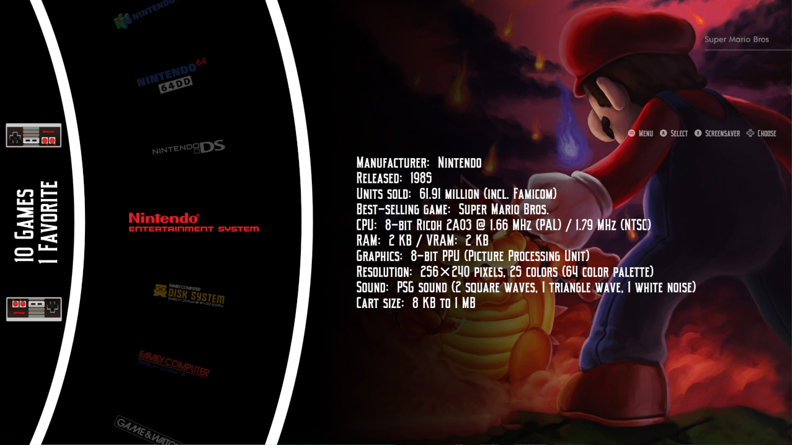
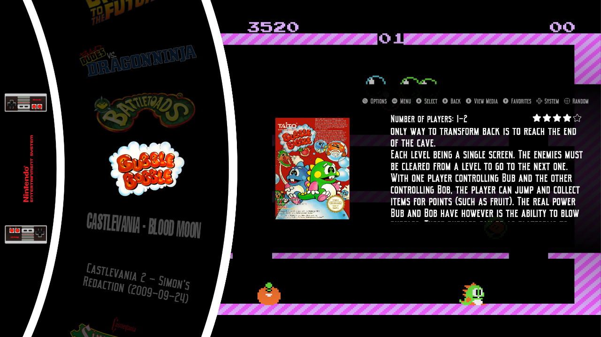

# Epic Simcar Remix for EmulationStation Desktop Edition v2.0

A Remix between Epic Noir (Revisited) and SimCar Carousel theme set for ES-DE.

The following options are included:

2 variants:

- With videos
- Without videos

Dark color scheme

4 aspect ratios:

- 16:9
- 16:10
- 4:3
- 21:9

# Credits

All the credit of the images is given to the original authors.
The theme has images from:
- Dan Patricks Logo set on launchbox forums
- Weestuarty theme SimCar
- antfortytwo, dragoonDorise, c64-dev and Chicuelo theme Epic Noir (Revisited)
Support for creating theme from the official emulationstation discord

# License

Attribution-NonCommercial-ShareAlike 2.0 (CC-BY-NC-SA) You are free to share and adapt this theme as long as you provide attribution back as well as share any updates you make under the same licence terms. You may not use this theme for commercial purposes.# epic-simcar-remix-es-de
